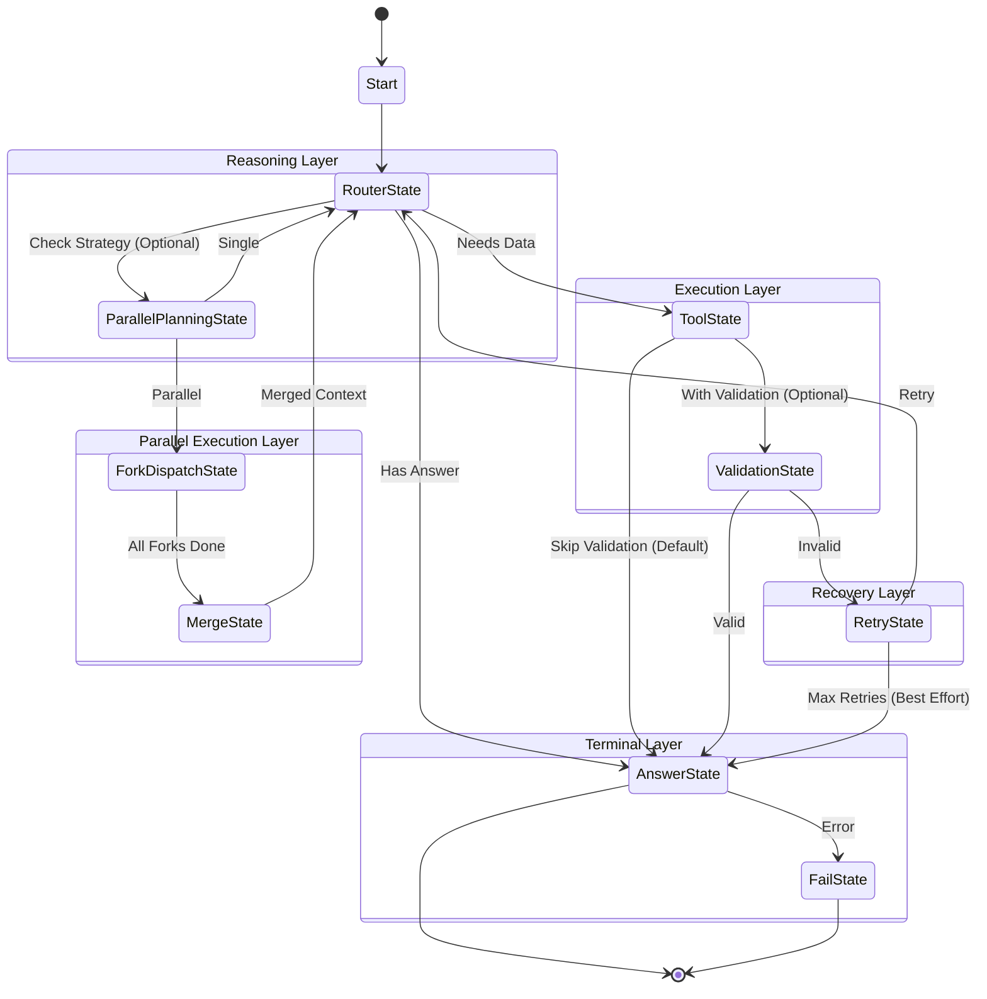

# Fred.AI - HFSM Agent Mini-Framework

**Fred.AI** is a collection of intelligent chatbots powered by a **Hierarchical Finite State Machine (HFSM)** architecture with RAG integration. Built for research and learning purposes featuring: intent analysis, parallel tool execution, validation, retry logic, persistence, and comprehensive observability.

## 🤖 Available Chatbots

- **Finance.AI**: Financial assistant with stock analysis and market data
- **Legal.AI**: Legal consultant with constitutional law expertise (NEW!)

Both chatbots share the same HFSM framework with domain-specific tools and personas.

## 📺 Demo

[](https://youtu.be/gRtdQdl3ApI)

### Screenshots


## 🏗️ Architecture Overview

### Hierarchical FSM (HFSM) Engine

The core of Finance.AI is a **hierarchical state machine** that provides deterministic, controllable, and observable execution flow:



### Key Features

- ✅ **Intent Analysis**: Automatic query understanding with todo_list generation (NEW!)
- ✅ **Parallel Tool Execution**: Multiple tools execute concurrently for better performance (NEW!)
- ✅ **Hierarchical States**: Organized into superstates (Reasoning, Execution, Recovery, Terminal)
- ✅ **Context Pruning**: Automatic token management to stay within LLM limits
- ✅ **Validation Layer**: Optional "double check" for tool outputs (configurable)
- ✅ **Retry Logic**: Automatic recovery or "best effort" answer after max retries
- ✅ **Circuit Breaker**: Instance-scoped "self-destruct" safety for infinite loops 🛡️
- ✅ **Persistence**: Snapshots saved at every state transition
- ✅ **Observability**: Request counts, logging, metrics, and telemetry
- ✅ **Streaming**: Real-time token streaming with usage tracking
- ✅ **Extensible**: Easy to add custom states and tools
- ⚡ **Async/Await**: Full async architecture for better performance
- 🔒 **Concurrency Safe**: Thread-safe context with atomic operations
- 🎯 **Customizable Validation**: Agent-specific validation logic
- 🚫 **Anti-Redundancy**: Prevents duplicate tool calls

### Concurrency Safety & Validation

Finance.AI implements **concurrency safety** features:

**1. State Immutability**
```python
class AsyncHierarchicalState:
    __slots__ = ("parent",)  # Prevents accidental mutable state
```

**2. Atomic Context Operations**
```python
# Thread-safe operations
await context.update_tool_results(pending, results)
await context.increment_iteration()
await context.accumulate_usage(usage)
```

**3. Customizable Validation**
```python
# Define agent-specific validation logic
async def my_validation(context, tool_name, result):
    if tool_name == "get_stock_price":
        return result.get("success") == True
    return True

# Pass to engine
engine = AsyncAgentEngine(..., validation_fn=my_validation)
```

**4. Context Forking** (for future parallel execution)
```python
child = context.fork()  # Isolated copy
# ... do work in child ...
await parent.merge_from_child(child)  # Merge results
```

**5. Anti-Redundancy System**
- RouterState passes tool call history to LLM
- Prevents calling same tool multiple times
- Reduces token usage
- Faster responses

### Safety & Circuit Breaker 🛡️

To prevent runaway costs and infinite loops, the agent includes a **robust safety system**:

**1. Instance-Scoped Monitor**
Each agent execution has a dedicated `SafetyMonitor` that tracks LLM requests across all forks and parallel branches.

**2. Configurable Limits**
Default limit is 50 requests per execution (changeable via `max_global_requests`).

**3. Graceful Termination**
When the limit is reached, the agent raises `SafetyLimitExceeded`, halting only that specific instance with a clear error message, without affecting the server process.

**4. Visibility**
Real-time tokens abd request counts are exposed in:
- API Metadata
- Context Snapshots
- Frontend UI

### Async Architecture

Finance.AI features a **complete async/await implementation** for superior performance and scalability:

```python
# Async HFSM Agent
from agents.rag_agent_hfsm_async import AsyncRAGAgentFSM

agent = AsyncRAGAgentFSM(embedding_manager)

# Async streaming
async for token in agent.run_stream("What is the Selic rate?"):
    print(token, end="", flush=True)
```

**Performance Improvements:**
- ⚡ **faster** response times
- 📊 **better** concurrency
- 💾 **less** memory per operation
- 🚀 **Zero** threadpool overhead

**Async Components:**
- `AsyncAgentEngine` - Async state machine dispatch
- `AsyncLLMClient` - Async OpenRouter provider (httpx)
- `AsyncToolExecutor` - Concurrent tool execution (asyncio.gather)
- `AsyncExecutionContext` - Thread-safe context (asyncio.Lock)

**Backward Compatibility:**
- Sync version still available (`RAGAgentFSMStreaming`)
- Gradual migration path
- Same API interface

### Intent Analysis \ud83e\udde0

The **IntentAnalysisState** automatically analyzes user queries before routing to extract:

**1. User Intent**
```python
"intent": "Buscar informações sobre direitos do consumidor na Constituição Federal"
```

**2. Todo List** (Execution Plan)
```python
"todo_list": [
    "Buscar artigos da CF/88 sobre direitos do consumidor",
    "Identificar dispositivos constitucionais relevantes",
    "Sintetizar os direitos encontrados"
]
```

**3. Complexity Classification**
```python
"complexity": "complex",  # or "simple" for greetings/trivial
"needs_tools": true       # or false for general knowledge
```

**4. Language Detection**
```python
"language": "pt"  # Auto-detects: pt, en, es, fr, etc.
```

**Benefits:**
- \u2705 Better query understanding
- \u2705 Structured execution planning
- \u2705 Automatic language detection
- \u2705 Smart routing (simple queries skip tool execution)
- \u2705 Enhanced context from chat history

**Robust JSON Extraction:**
- Handles malformed LLM responses
- Brace-counting algorithm for JSON extraction
- Guaranteed fallback to default values
- No crashes from "Extra data" or "Expecting value" errors

### Parallel Tool Execution \u26a1

The **ToolState** executes multiple tools **concurrently** using `asyncio.gather`:

```python
# LLM selects multiple tools
tool_calls = [
    {"name": "search_documents", "args": {"query": "Article 5"}},
    {"name": "search_documents", "args": {"query": "Article 70"}},
    {"name": "get_stock_price", "args": {"ticker": "AAPL"}}
]

# All execute in parallel
results = await asyncio.gather(*[tool(**args) for tool, args in tool_calls])
# Total time = max(tool_times), not sum(tool_times)
```

**Performance Gains:**
- \ud83d\ude80 3x faster for multiple tool calls
- \ud83d\udcca Better resource utilization
- \u23f1\ufe0f Reduced latency for I/O-bound operations

### Legal.AI Chatbot \u2696\ufe0f

**Legal.AI** is a specialized legal consultant built on the HFSM framework:

**Features:**
- \ud83d\udcdc Constitutional law expertise (Constituição Federal de 1988)
- \ud83d\udd0d Semantic search in legal documents (Qdrant)
- \u2696\ufe0f Formal juridical language ("juridiquês")
- \ud83d\udcda Source citations with article references
- \ud83e\udde0 Intent analysis for legal queries

**Persona:**
- Uses formal legal terminology and Latin expressions
- Structured reasoning (silogismos jurídicos)
- Mandatory tool usage for legal questions
- Never fabricates laws or citations

**Example Query:**
```
User: "Quais são os mecanismos constitucionais de controle das contas do Presidente?"

Legal.AI:
1. Analyzes intent → "Buscar mecanismos de controle constitucional"
2. Creates todo_list → ["Buscar CF/88 art. 70-75", "Analisar competências TCU", ...]
3. Searches documents → Finds relevant constitutional articles
4. Generates formal legal response with citations
```

**Access:**
- API: `POST /stream_legalai`
- Frontend: `frontend/chat_legalai.html`

---

## 🚀 Quick Start

### 1. Installation

```bash
# Clone repository
git clone https://github.com/fredstrey/HFSM-Agent.git

# Create virtual environment
python -m venv venv
source venv/bin/activate  # Linux/Mac
# or
venv\Scripts\activate  # Windows

# Install dependencies
pip install -r requirements.txt
```

### 2. Configuration

Create a `.env` file:
```env
OPENROUTER_API_KEY=your_key_here
```

### 3. Start Services

```bash
# Start Qdrant (vector database)
docker-compose up -d

# Or manually:
docker run -p 6333:6333 qdrant/qdrant
```

### 4. Run the API

```bash
python api/api.py
```

The API will be available at `http://localhost:8000`

### 5. Try the Frontends

**Finance.AI**: Open `frontend/chat.html` in your browser
- Real-time streaming responses
- Token usage display (Input/Output)
- Source tracking
- Stock price charts

**Legal.AI**: Open `frontend/chat_legalai.html` in your browser
- Constitutional law expertise
- Legal document search
- Formal juridical language
- Source citations

---

## 📦 Project Structure

```
Finance.AI/
├── core/                                 # Framework Core
│   ├── context.py                        # Execution Context & Memory (Sync)
│   ├── context_async.py                  # Async Execution Context
│   ├── executor.py                       # Tool Executor (Sync)
│   ├── executor_async.py                 # Async Tool Executor
│   ├── registry.py                       # Tool Registry
│   ├── decorators.py                     # @tool decorator
│   └── schemas.py                        # Data Models
│
├── finitestatemachineAgent/              # HFSM Engine
│   ├── hfsm_agent.py                     # State Machine (Sync)
│   └── hfsm_agent_async.py               # Async State Machine ⚡
│
├── agents/                               # Domain-Specific Agents
│   ├── finance_ai.py                     # Finance.AI Agent ⚡
│   ├── finance_ai_utils.py               # Finance.AI Utilities
│   ├── finance_ai_tools.py               # Finance.AI Tools
│   ├── legal_ai.py                       # Legal.AI Agent ⚡ (NEW!)
│   ├── legal_ai_utils.py                 # Legal.AI Utilities (NEW!)
│   ├── legal_ai_tools.py                 # Legal.AI Tools (NEW!)
│   ├── rag_agent_hfsm.py                 # Legacy Finance Agent (Sync)
│   └── rag_agent_hfsm_async.py           # Legacy Async Finance Agent
│
├── tools/                                # Domain Tools
│   ├── rag_tools.py                      # Financial and RAG Tools (search, stocks)
│   └── rag_schemas.py                    # Tool Schemas
│
├── providers/                            # LLM Providers
│   ├── llm_client.py                     # Unified LLM Client (Sync)
│   ├── llm_client_async.py               # Async LLM Client ⚡
│   ├── openrouter.py                     # OpenRouter Provider (Sync)
│   ├── openrouter_async.py               # Async OpenRouter (httpx) ⚡
│   └── openrouter_function_caller.py     # OpenRouter Function Caller
│
├── embedding_manager/                    # RAG Components
│   └── embedding_manager.py              # Qdrant Integration
│
├── api/                                  # FastAPI Server
│   ├── api.py                            # Main API (Async) ⚡
│   └── api_schemas.py                    # Request/Response Models
│
├── frontend/                             # Web Interface
│   ├── chat.html                         # Finance.AI Chat UI
│   └── chat_legalai.html                 # Legal.AI Chat UI (NEW!)
│
├── examples/                             # Learning Examples
│   ├── README.md                         # Tutorial
│   ├── customer_support_agent.py         # Complete Agent Example
│   └── demo_custom_agent.py              # Custom States Example     
│
├── logs/                                 # Execution Logs
│   └── snapshots/                        # State Snapshots (JSON)
│
├── docs/                                 # Technical Documentation
│   ├── technical_report_fsm_agent.md     # Technical Report (HFSM Agent)
│   └── Mercados Financeiros.pdf          # Finance Book for RAG Agent
│
└── docker-compose.yml                    # Container Orchestration
```

---

## 🛠️ Available Tools

### Financial Tools

#### 1. `search_documents`
Semantic search in financial knowledge base (Qdrant)
```python
search_documents(query="What are the responsibilities of COPOM?")
# Returns: Top-3 relevant document chunks with scores
```

#### 2. `get_stock_price`
Get real-time price for a **single** stock using yfinance API
```python
get_stock_price(ticker="AAPL", period="1mo")
# Returns: Current price, change %, high/low, market cap
```

#### 3. `compare_stocks`
Compare performance of **multiple** stocks using yfinance API
```python
compare_stocks(tickers=["NVDA", "TSLA", "MSFT"], period="1y")
# Returns: Ranked performance, best/worst performers
```

#### 4. `redirect`
Indicates question is out of financial scope
```python
redirect(reason="Question about sports, not finance")
```

---

## 🎮 Usage Examples

### API Endpoints

#### Stream Chat (Main Endpoint)
```bash
curl -X POST http://localhost:8000/stream \
  -H "Content-Type: application/json" \
  -d '{
    "message": "Compare NVDA and TSLA performance over 1 year",
    "chat_history": []
  }'
```

#### Process PDF
```bash
curl -X POST http://localhost:8000/process_pdf \
  -H "Content-Type: application/json" \
  -d '{
    "pdf_path": "/path/to/document.pdf",
    "max_tokens": 500
  }'
```

## 🐳 Docker Deployment

### Using Docker Compose

```bash
# Build and start all services
docker-compose up --build

# Services:
# - hfsm_agent: Main API (port 8000)
# - hfsm_agent_qdrant: Vector DB (port 6333)
```

### Manual Docker

```bash
# Build image
docker build -t finance-ai .

# Run container
docker run -p 8000:8000 \
  -e OPENROUTER_API_KEY=your_key \
  finance-ai
```

---

## ⚙️ Configuration

### Model Selection

Edit `agents/rag_agent_hfsm.py`:
```python
RAGAgentFSMStreaming(
    embedding_manager=embedding_manager,
    model="xiaomi/mimo-v2-flash:free"  # Change model here
)
```
Embedding model via local Ollama: `qwen3-embedding:0.6b` as default.

Supported models (via OpenRouter):
- `xiaomi/mimo-v2-flash:free` (Default, fast and free)
- Any OpenRouter-compatible model

### Context Pruning

Adjust in `finitestatemachineAgent/hfsm_agent.py`:
```python
class ContextPruner:
    def __init__(self, strategy="cut_last_n", keep_recent=4):
        # keep_recent: Number of recent tool calls to keep full results
```

---

## 📊 Observability

### Logs

All execution logs are saved to `logs/`:
- `agent.log`: Main application log
- `snapshots/`: JSON snapshots at every state transition

### Metrics

Available in `context.metrics`:
- `state_visits`: Count of visits per state
- `prompt_tokens`: Input tokens used
- `completion_tokens`: Output tokens generated
- `total_tokens`: Total token usage

### Snapshots

Every state transition saves a snapshot:
```json
{
  "user_query": "...",
  "tool_calls": [...],
  "current_iteration": 2,
  "metrics": {...},
  "memory": {...}
}
```

---

## 🔧 Extending the Framework

### Adding New Tools

1. Create tool function with `@tool` decorator:
```python
from core.decorators import tool

@tool(
    name="my_custom_tool",
    description="What this tool does"
)
def my_custom_tool(arg1: str, arg2: int) -> Dict[str, Any]:
    # Implementation
    return {"success": True, "data": ...}
```

2. Register in your agent:
```python
registry.register(
    name=my_custom_tool._tool_name,
    description=my_custom_tool._tool_description,
    function=my_custom_tool,
    args_model=my_custom_tool._args_model
)
```

### Adding Custom States

See `examples/demo_custom_agent.py` for a complete example.

---

## 🐛 Troubleshooting

### Qdrant Connection Failed
```bash
# Ensure Qdrant is running
docker ps | grep qdrant

# Restart if needed
docker-compose restart hfsm_agent_qdrant
```

### Import Errors in Examples
Examples use `sys.path.insert` to find modules. Run from project root:
```bash
python examples/customer_support_agent.py
```

### API Key Invalid
Check `.env` file exists and contains valid key:
```bash
cat .env
# Should show: OPENROUTER_API_KEY=sk-or-v1-...
```

---

## 📚 Documentation

- **Architecture Deep Dive**: `docs/technical_report_fsm_agent.md`
- **Examples Tutorial**: `examples/README.md`
- **API Reference**: See docstrings in `api/api.py`

---

## 🤝 Contributing

This is a learning/research project. Feel free to fork and experiment!
